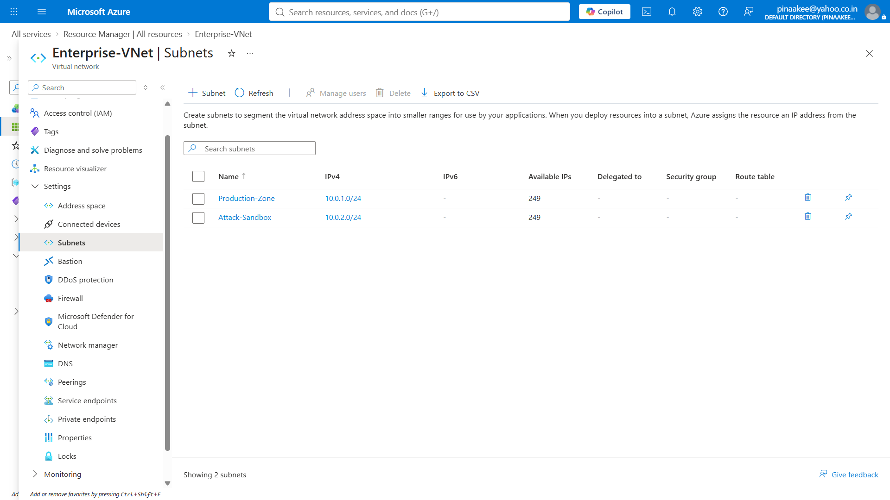
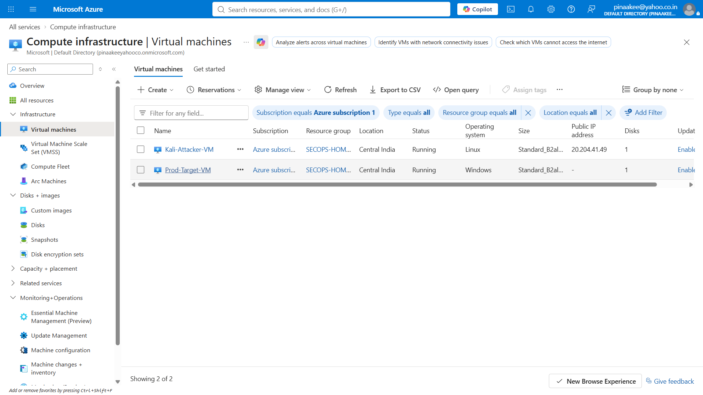
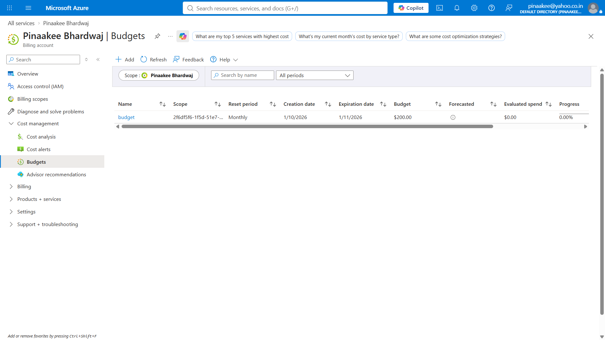
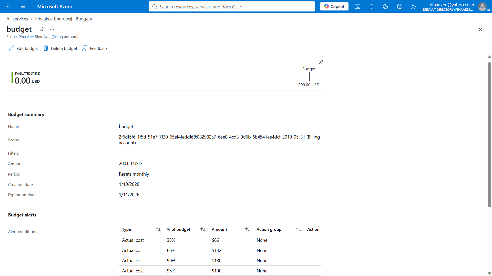
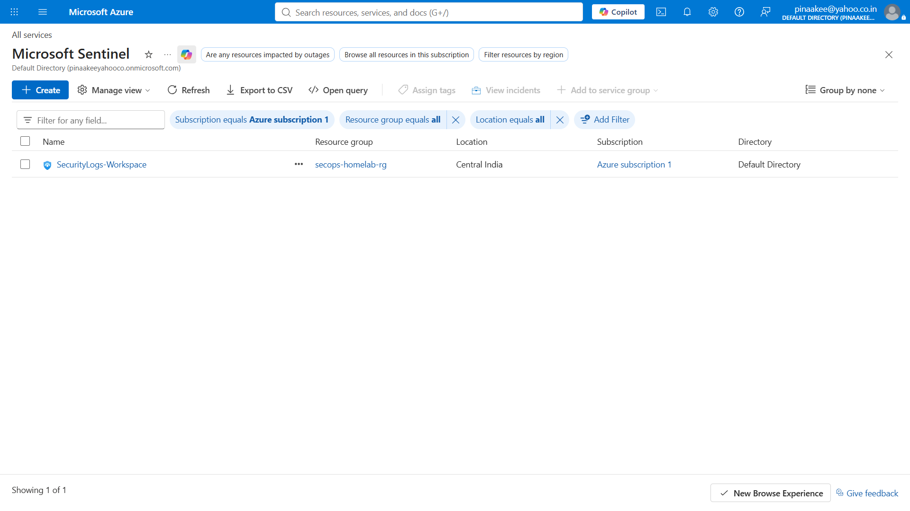
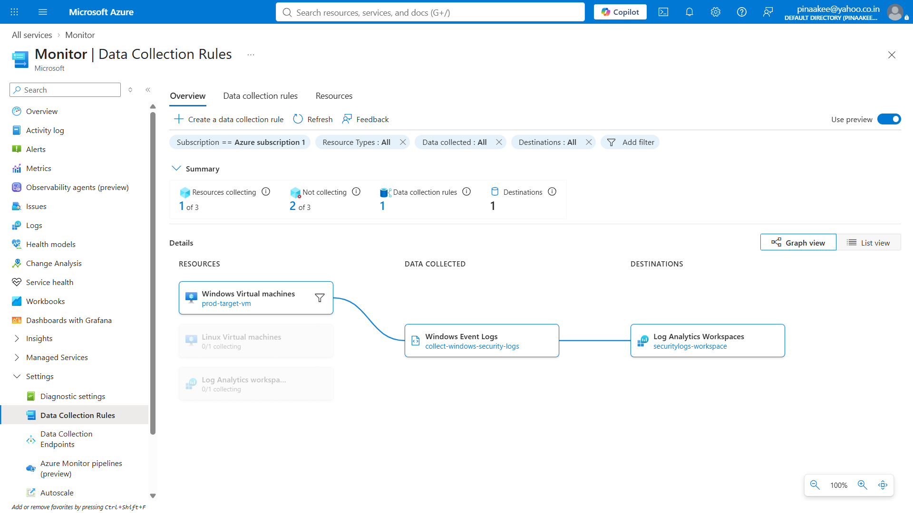

# Azure-CloudSec-HomeLab

# Cloud Security Infrastructure & SIEM Architecture Lab

## 📌 Project Overview
This project details the end-to-end engineering, isolation, and monitoring configuration of an enterprise-mimic security operations lab built entirely within **Microsoft Azure**. The architecture bridges defensive engineering with offensive testing, creating a secure multi-subnet cloud topology that funnels host telemetry into a centralized **Microsoft Sentinel SIEM** workspace.

By implementing strict financial controls, granular firewall matrices, and automated endpoint configurations, this lab simulates a live corporate perimeter environment designed to ingest and analyze real-world brute-force authentication traffic.

---

## 🏗️ Architectural Topology & Specifications

### 1. Networking Layout
- **Virtual Network Space (VNet):** `10.0.0.0/16`
- **Production Zone Subnet:** `10.0.1.0/24` (Hosts targeted infrastructure nodes and honeypot assets)
- **Attack Sandbox Subnet:** `10.0.2.0/24` (Segregated zone hosting offensive testing toolsets)



### 2. Deployed Infrastructure Nodes
- **`Prod-Target-VM`:** Windows Server 2022 Datacenter (`Standard_B2s` instance) positioned within the Production Zone. Configured with a dynamic Public IP routing entry to serve as an internet-facing honeypot.
- **`Kali-Attacker-VM`:** Ubuntu/Kali Linux platform (`Standard_B2s` instance) deployed directly into the isolated Attack Sandbox for secure cross-subnet penetration testing and vulnerability validation.



---

## 🛠️ Detailed Configuration Matrix

### Phase 1: Operational Cost & Budgetary Guardrails
To prevent unexpected cloud overhead, strict fiscal boundaries were established immediately post-tenant initialization:
- **Azure Cost Management Cap:** Configured a hard monthly evaluation budget ceiling of `$200`.
- **Automated Threshold Alarms:** Engineered an asynchronous monitoring rule triggering immediate email updates to the administrator upon hitting **33%**, **66%**, **90%**, **95%** of actual budget consumption.
- **Automated Compute Cutoffs:** Enabled daily localized cron-based **Auto-shutdown** profiles across all virtual machines, setting a strict daily deallocation cutoff at **07:00:00 PM IST** to negate dormant runtime billing.




### Phase 2: Ingress/Egress Perimeter Firewall Controls (NSGs)
Perimeter defenses were crafted using Network Security Groups (NSGs) to cleanly isolate testing traffic from production assets:
- **Honeypot Exposure Profile:** Inbound cloud rule explicitly opened on the target network interface, mapping public traffic on port `3389` (**RDP**) with a high priority index (`100`) to intentionally collect automated external threat scans.
- **Cross-Subnet Pivot Tunneling:** Permitted bidirectional scanning routing arrays specifically tracking traffic arriving *from* the Attack Sandbox (`10.0.2.0/24`) to navigate internally into the Production target node for safe boundary pentesting, while dropping unauthorized external sweeps.

### Phase 3: SIEM Telemetry & Data Collection Pipelines
Log centralization was completed to build a functional Security Operations Workspace:
- **SIEM Core:** Provisioned a central **Log Analytics Workspace** (`SecurityLogs-Workspace`) and overlaid the enterprise **Microsoft Sentinel** analytics engine.
- **Endpoint Agent Deployment:** Installed the unified **Azure Monitor Agent (AMA)** extension directly to the Windows endpoint kernel interface.
- **Data Collection Rules (DCR):** Defined custom ingestion parsing filters (`Collect-Windows-Security-Logs`) targeted to continuously stream **All Security Events** data directly into the central `SecurityEvent` log database tables.




---

## 🔍 Verification & Threat Hunting Queries (KQL)

Once endpoint telemetry maps completely to the Sentinel tables, the following operational **Kusto Query Language (KQL)** hunting scripts were engineered to parse live event streams inside the SOC workspace console:

### Query 1: Top 10 Global Brute-Force Attacker Origins
This query isolates automated password-spraying campaigns hitting the honeypot by parsing failed authentication metrics (`EventID 4625`):
```kusto
SecurityEvent
| where EventID == 4625 // Filter for explicit failed logon attempts
| summarize AttemptCount = count() by LogonTypeName, IpAddress, TargetAccount
| top 10 by AttemptCount desc
```

### Query 2: Identifying Suspicious Account Username Enumeration
Tracks whether malicious bots are attempting to brute-force non-existent or common corporate administrator aliases:
```kusto
SecurityEvent
| where EventID == 4625
| summarize UserCount = dcount(TargetAccount) by IpAddress
| where UserCount > 5
| order by UserCount desc
```

---

## ⚠️ Engineering Triage, Roadblocks & Deep-Dive Troubleshooting

A primary highlight of this lab setup involved debugging complex integration boundaries between the Azure Control Plane, third-party operating system packages, and local endpoint logic:

1. **Marketplace Terms & Hibernation Validation Deficiencies:** 
   Initial deployments encountered `NotAvailableForSubscription` and validation failures due to choosing unbacked VM sizes (`Standard_D2s_v3`) or enabling hardware-managed Hibernation loops. Resolving this required downgrading compute templates to standard burstable **B-series configurations** (`Standard_B2s`) and shifting cost-containment architecture exclusively to portal-driven deallocation scripts.
   
2. **Local OS-Level Firewalls (The Endpoint Blind Spot):** 
   While the cloud perimeter firewall (NSG) passed traffic properly, host-level network traces showed local **Windows Defender Firewall Profiles** drop connections silently before reaching the auditing engine. Disabling Domain, Private, and Public profiles inside the test target machine was required to allow smooth ingestion mapping.

3. **Host Ingestion Auditing Constraints (`secpol.msc`):** 
   A hidden hurdle occurred when the Azure Monitor Agent remained online but reported zero rows inside the Sentinel `SecurityEvent` database. Triage pinpointed that default Windows Server installations do not log local authentication failures. Accessing the node via RDP to manually toggle the **Local Security Policy** console under `Audit logon events` and `Audit account logon events` to monitor both **Success** and **Failure** marks the definitive path to opening the endpoint data feed.

---

## 📈 Key Professional Competencies Demonstrated
- Cloud Architecture Design & Multi-Subnet Network Isolation
- SIEM Infrastructure Management (Microsoft Sentinel / Log Analytics)
- Host-Level Auditing Policies & Threat Telemetry Logging Pipelines
- Infrastructure Cost-Containment & Cloud Financial Governance
- Practical Triage, Kernel Extensions, & Systems Troubleshooting
